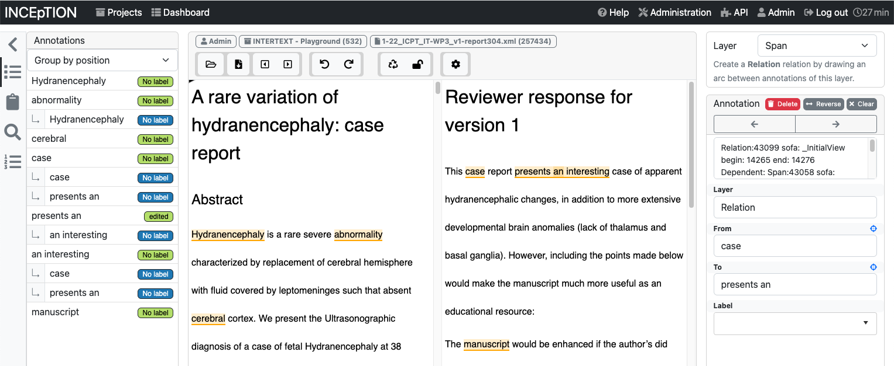

# INCEpTION Intertext Editor Plugin

**Note: This is an early access repository. The way that things work will likely be subject to regular changes for the time being.** 



This repository is an example based on the [RecogitoJS](https://github.com/recogito/recogito-js) JavaScript editor component of how to integrate a JavaScript-based annotation editor with INCEpTION. It also uses a special CSS stylesheet to render two separately scrolling areas. This feature depends on the **generic XML** importer from INCEpTION and requires that the imported files follow this structure:

````
<div class="view-side-by-side">
  <div class="view-left">
    ...
  </div>
  <div class="view-right">
    ...
  </div>
</div>

```

Starting with INCEpTION v23, external editor plugins are supported. To use this editor, first create a folder named `editors` in your INCEpTION application home. By default, this is `~/.inception`, but on server installations, you will usually have set it to something else such as `/srv/inception`.

Clone this repository as a sub-folder under the `editors` folder.

tl;dr: 

```
$ cd /srv/inception
$ mkdir editors
$ git clone https://github.com/inception-project/inception-intertext-editor-plugin.git
```

Finally, start INCEpTION. Early during start-up, you should see a message like this:

```
ExternalEditorLoader - Loading editor plugin: Intertext (external)
```

Also, on the annotation page, you should be able to switch to that editor.
